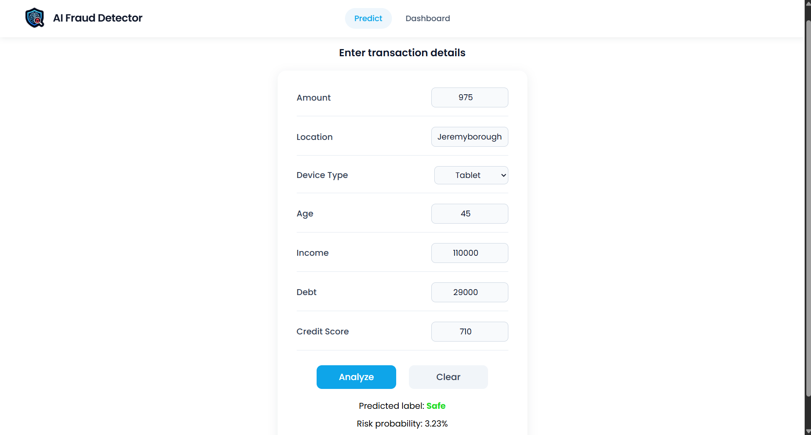
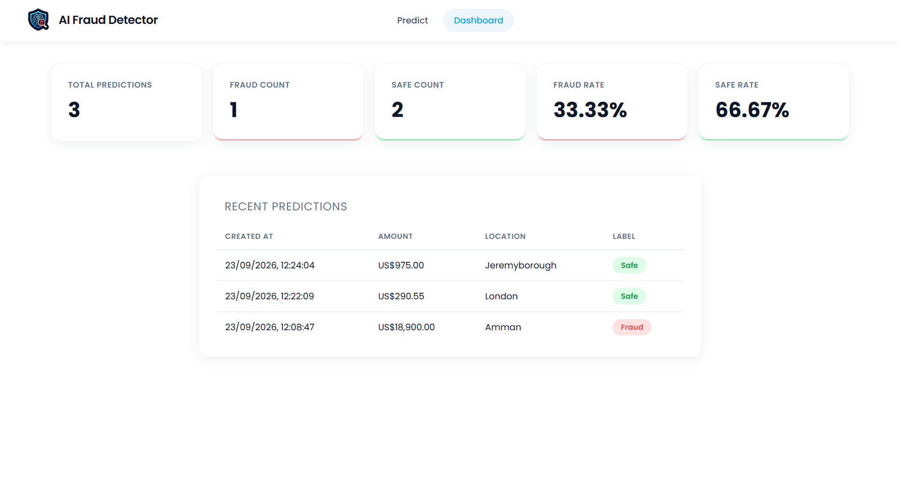

# AI Fraud Detector

A full-stack fraud detection app that predicts whether a transaction is fraudulent using a trained XGBoost pipeline, with a FastAPI backend, PostgreSQL storage, and a React dashboard.

## Features

- Predicts fraud risk for a transaction based on amount, location, device type, age, income, debt, and credit score
- Stores every prediction in PostgreSQL for history and analytics
- Dashboard with total predictions, fraud/safe counts, fraud rate, and a table of recent predictions
- REST API built with FastAPI, documented automatically at `/docs`

## Tech Stack

**Machine Learning**
- scikit-learn (preprocessing pipeline: `StandardScaler` + `OneHotEncoder`)
- XGBoost (classifier)
- pandas / numpy
- Trained in [`ml/train.ipynb`](ml/train.ipynb), serialized with `joblib`

**Backend**
- FastAPI
- SQLAlchemy (ORM)
- PostgreSQL
- Pydantic (request/response validation)

**Frontend**
- React 19 (Vite)
- React Router
- Axios

## Project Structure

```
backend/
  app/
    main.py               # FastAPI app setup, CORS, routers
    api/
      predictions.py      # POST/GET /predictions endpoints
      dashboard.py         # /dashboard/stats and /dashboard/recent endpoints
    database/
      database.py          # SQLAlchemy engine, session, Base
    models/
      prediction.py         # SQLAlchemy ORM model
    schemas/
      prediction.py         # Pydantic request/response schemas
      dashboard.py           # Pydantic dashboard schemas
    ml/
      model.py              # Loads the trained pipeline and runs predictions
      fraud_model.pkl       # Trained model artifact
  requirements.txt

frontend/
  src/
    components/
      Header.jsx
      PredictForm.jsx       # Prediction form page ("/")
      Dashboard.jsx          # Dashboard page ("/dashboard")
      StatCard.jsx
      RecentTable.jsx

ml/
  fraud_detection_dataset.csv
  train.ipynb                # Data preprocessing, training, and evaluation
```

## Setup

### Prerequisites

- [Python 3.11+](https://www.python.org/downloads/)
- [Node.js 18+](https://nodejs.org/)
- [PostgreSQL](https://www.postgresql.org/download/) (installed and running locally)

### 1. Database

Create a new PostgreSQL database for the app. Using `psql`:

```sql
CREATE DATABASE fraud_detection;
```

Or via pgAdmin: right-click **Databases** → **Create** → **Database...**, and give it a name.

Then create a `.env` file inside `backend/` with your connection details:

```
DATABASE_URL=postgresql://postgres:<password>@localhost:5432/<database_name>
```

Replace `<password>` with your PostgreSQL role's password and `<database_name>` with the name you chose above. Tables are created automatically the first time the backend starts, so no manual migration step is needed.

### 2. Backend

```powershell
cd backend
python -m venv venv
.\venv\Scripts\Activate.ps1
pip install -r requirements.txt
uvicorn app.main:app --reload
```

The API will be available at `http://127.0.0.1:8000`, with interactive docs at `http://127.0.0.1:8000/docs`. Tables are created automatically on startup.

### 3. Frontend

```powershell
cd frontend
npm install
npm run dev
```

The app will be available at `http://localhost:5173`.

## Retraining the Model

The training pipeline lives in [`ml/train.ipynb`](ml/train.ipynb). It reads `ml/fraud_detection_dataset.csv`, builds a preprocessing + XGBoost pipeline, and saves the result to `backend/app/ml/fraud_model.pkl`. Re-run the notebook after changing the dataset or preprocessing steps, then restart the backend to load the updated model.

## Application Screenshots

### 1. Predict Form


### 2. Dashboard
